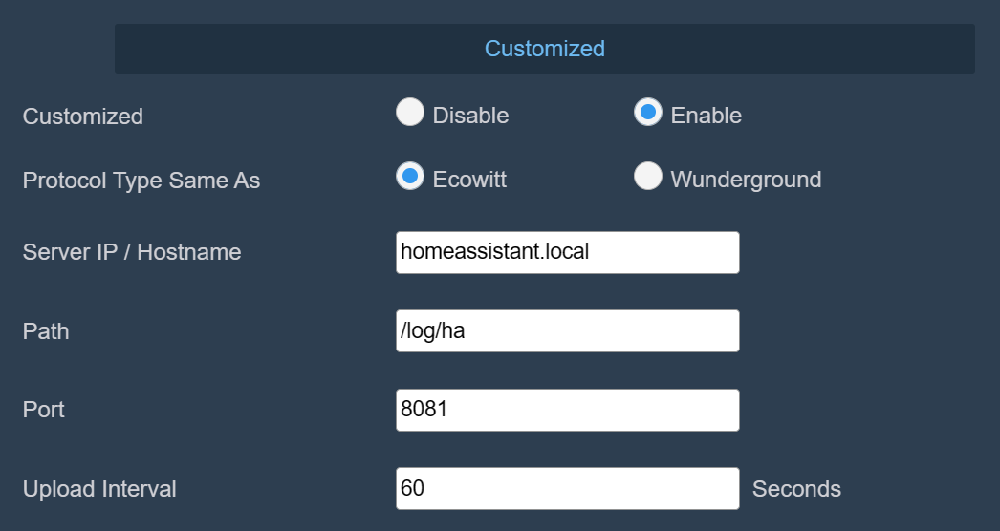

# Home Assistant Add-on: Ecowitt Proxy

## How to Use

In your Ecowitt gateway, configure as you would for the [Home Assistant Ecowitt Integration](https://www.home-assistant.io/integrations/ecowitt/), substuting the `Path` option with `/log/ha` only. Do not include your webhook ID here; it will be added to the path automatically by the add-on.

